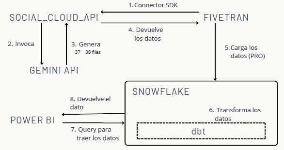
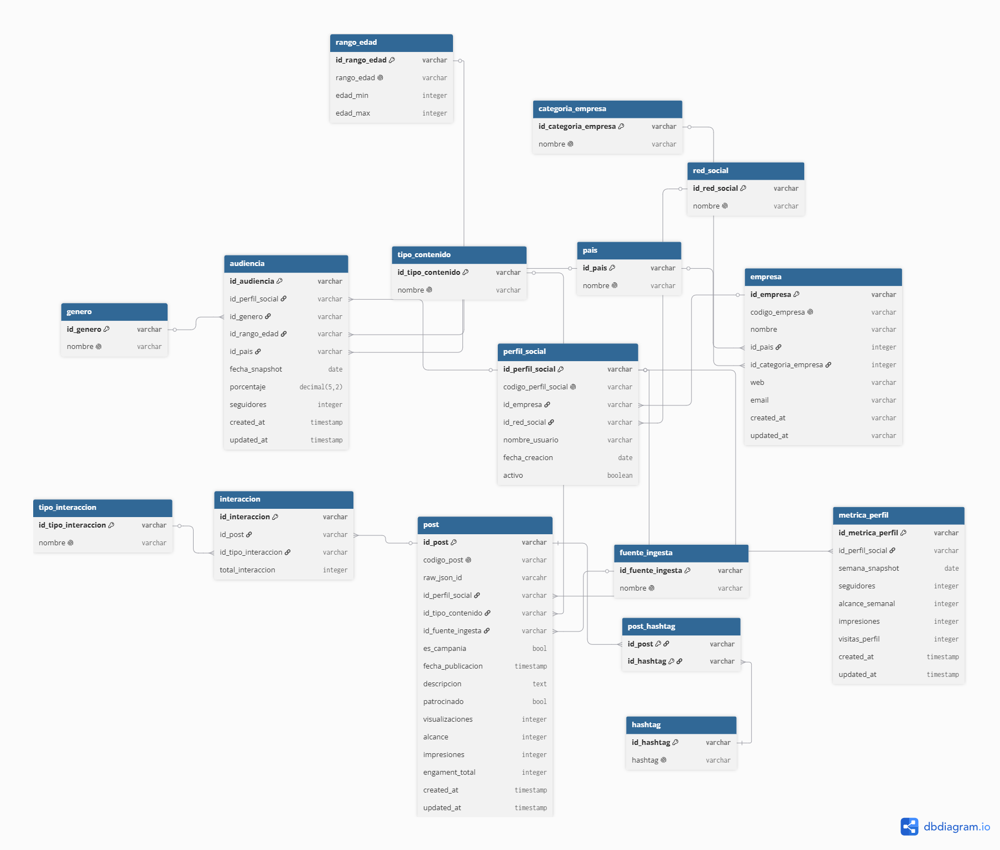
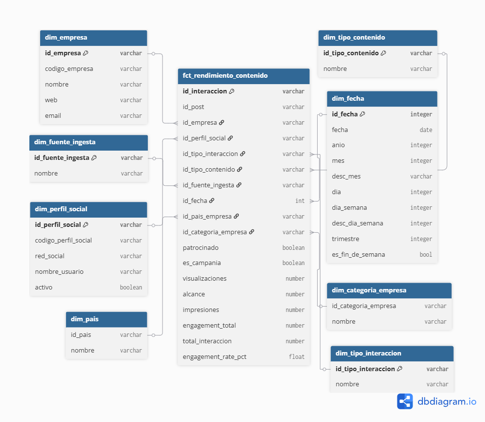
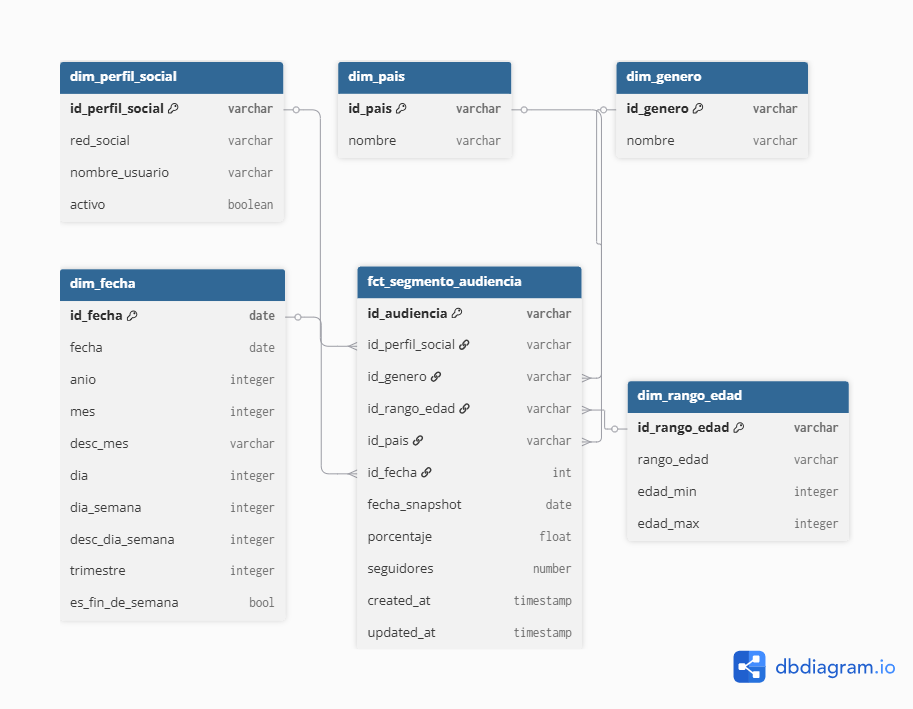
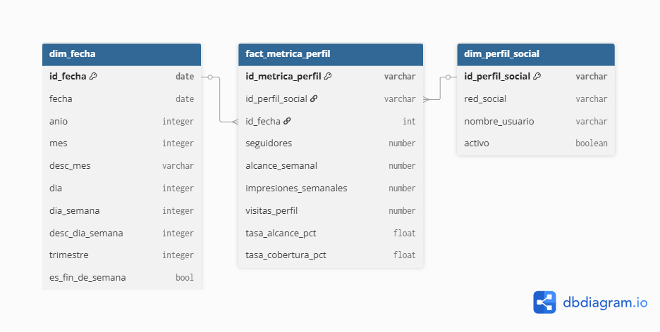

# Social cloud

## Objetivos
El punto de partida de social cloud es una necesidad real. Las empresas publican contenido en redes sociales pero les gustaría poder anticiparse a lo que funciona. Social cloud pretende resolver eso mismo. 

Tiene 3 objetivos:
* Construir un pipeline automatizado que mueva y transforme los datos sin intervención manual.
* Analizar el rendimiento del contenido
* Entender el comportamiento de la audiencia según el país, edad y género. 

En resumen, convertir datos brutos de redes sociales en decisiones de negocio.

## Tecnologías usadas

Para construirlo he usado tecnologías de datos en la nube como:

* Fivetran
* Snowflake
* dbt
* Power BI
* Git/GitHub

## Entornos
El proyecto está estructurado en 3 entornos separados: desarrollo, preproducción y producción. Cada entorno tiene sus propias bases de datos siguiendo la arquitectura medallion. En total suma 9 bases de datos. Garantizando que producción no se vez afectado durante el desarrollo.

## Preguntas
El proyecto exite para responder preguntas concretas de negocio.

### Rendimiento de contenido
1. ¿Qué tipos de contenido genera más engagement?
2. ¿Cómo evoluciona el engagement a lo largo del tiempo por red social?
3. ¿Cuál es el top 3 de países que concentran más interacciones?
4. ¿Cuál es la cantidad total de posts patrocinados para una categoría de empresa?

### Audiencia
1. ¿Qué paises tienen más seguidores?
2. ¿Qué peso tiene la audiencia femenina por país?
3. ¿Qué franja de edad concentra más audiencia?
4. ¿Cómo se distribuye la audiencia por red social?

### Negocio
1. ¿En qué red social debo invertir más?
2. ¿A qué perfil demográfico estoy llegando realmente?

## Test
Los test me sirven para mantener la calidad del dato, ya que, si el dato está mal, las decisiones no serán las correctas. En total tengo 241 tests.
* Genéricos (239): me sirven para validar, por ejemplo, el nombre del perfil social no sea null.
* Singular (1): con ellos valido la lógica de negocio. En mi caso, valido que el engagement total de un post no sea menor a una de sus interacciones.
* Unitarios (1): valido que el modelo realiza correctamente el desduplicado.

## Pipeline 

El flujo del dato de Social Cloud sigue una arquitectura ELT. 

### 1. Fivetran se conecta a la API mediante Connector SDK
El proceso comienza cuando Fivetran utiliza un conector desarrollado con el Connector SDK para comunicarse con **social_cloud_api**. El objetivo de este componente es automatizar la extracción de información desde la API externa.

**NOTA:**: Todo el proceso se realiza para simular una ingesta diaria y automatizada. Las fechas que se usan son siempre la misma, lo que cambia son los perfiles. Para no repetir perfiles y tener el número del último post guardado, lo guardo en el state del conector.

### 2. La API invoca a Gemini API
Una vez reciba la petición, **social_cloud_api** formatea los prompts con el perfil elegido aleatoriamente. 

**NOTA:** La API está desplegada en Render y necesita una API KEY de Gemini.

### 3. Gemini genera la información 
Gemini procesa la solicitud y devuelve entre 37 y 38 filas de información sobre una snapshot de un perfil, varias filas de audiencia y un post con las diferentes interacciones. En esta etapa se produce realmente la generación de los datos que posteriormente serán analizados.

### 4. Social Cloud API devuelve los datos a Fivetran 
Después de recibir la respuesta de Gemini, **social_cloud_api** entrega los datos procesados al conector de Fivetran. Este añade al state el nuevo perfil procesado.

Aquí termina la fase de extracción del pipeline.

### 5. Fivetran carga los datos en Snowflake.
Fivetran inserta automáticamente la información obtenida dentro de Snowflake, en el entorno de producción. No sabía si añadir los nuevos datos en el entorno de producción o desarrollo. Me decanté por producción porque es aquí donde me interesa tener todos los datos actualizados, ya que, en desarrollo no tiene porqué tener siempre los datos actualizados (en este entorno añado datos cada dos días).

Ya que no pude mergear los datos desde Fivetran en las tablas donde realicé la primera ingesta y este me creaba un nuevo esquema. Para solucionar este problema realicé diferentes tareas en los entornos. Cada entorno tiene 3 tareas que se encarga de sincronizar los datos con la tabla correspondiente. En los entornos de pre y pro se ejecutarán todos los días, mientras que en dev se ejecuta una vez cada dos días.
1. sync_perfiles
2. sync_posts
3. sync_audiencia

### 6. Grano de los datos
Antes de entrar en dbt, vamos a ver cuál es el grano de los datos en las 3 tablas que hay en bronze. 
1. raw_audiencia_demografica: un registro representa el porcentaje que tiene un segmento demográfico concreto para un perfil de una fecha específica en una red social.
2. raw_perfiles_empresas: un registro representa las métricas semanales para un perfil en una red social (YouTube, TikTok e Instagram).
3. raw_post_interacciones: un registro representa un tipo de interacción de un post concreto. Cada post tiene 4 filas, ya que, hay 4 interacciones diferentes (like, guardado, comentarios y compartido).

### 7. dbt transforma los datos
Una vez cargados, entra en acción dbt. La estructura de modelos que sigue Social Cloud es:
* Staging: modelos que tienen vistas 1:1 a bronze. Realizo pequeñas modificaciones, por ejemplo, como poner la primera palabra en mayúsculas y el resto en minúsculas, estandarización de valores (TK lo modifico a TikTok), etc. Añado freshness para asegurar que los datos vienen con la frescura esperada.
* Intermediate: Realizo la normalización de los datos para obtener el modelo relacional. Los modelos en base están para unificar la lógica, la cuál van a necesitar los siguientes modelos.

* Marts: En esta carpeta es donde desarrollo todo lo relacionado al modelo dimensional. 
    * Modelo dimensional de rendimiento del contenido:
        
    * Modelo dimensional de segmento audiencia:
        
    * Modelo dimensional de métrica perfil:
        

### 8. Power BI consulta los datos transformados
Power BI se conecta a Snowflake sobre las tablas ya transformadas por dbt.

### 9. Snowflake devuelve los datos a Power BI
Finalmente, Snowflake devuelve los resultados de las consultas a Power BI.

En Power BI, desarrollo dos cuadros de mandos donde se responde las preguntas enteriormente descritas.
